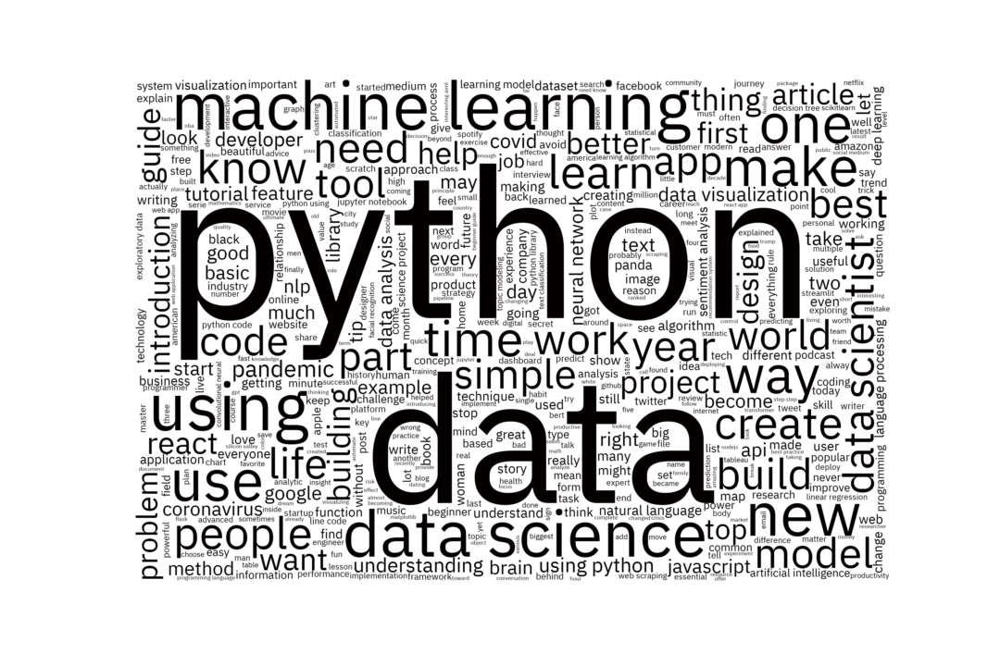

# digesting-the-digest

Using the Gmail API to topic model my recommended Medium reads

## Data Preview

|    | date                      | text                 |
|---:|:--------------------------|:---------------------------------------------------------------------------------------------------------------------------|
|  0 | 2021-09-19 11:40:00+00:00 | summarizing paper python gpt using python openais gpt summarize paper                                                      |
|  1 | 2021-09-19 11:40:00+00:00 | text analysis social science new spectrum possibility                                                                      |
|  2 | 2021-09-19 11:40:00+00:00 | visual time series forecasting streamlit prophet deploy app train evaluate optimize time series forecasting model visually |
|  3 | 2021-09-19 11:40:00+00:00 | powerful function python must know function python explained code                                                          |
|  4 | 2021-09-19 11:40:00+00:00 | start using annotation python code understanding function variable annotation python                                       |

## Interactive Streamlit Figures

## Good Riddance 👋

We can do better than wordclouds! They were overrated, anyways 🤭
